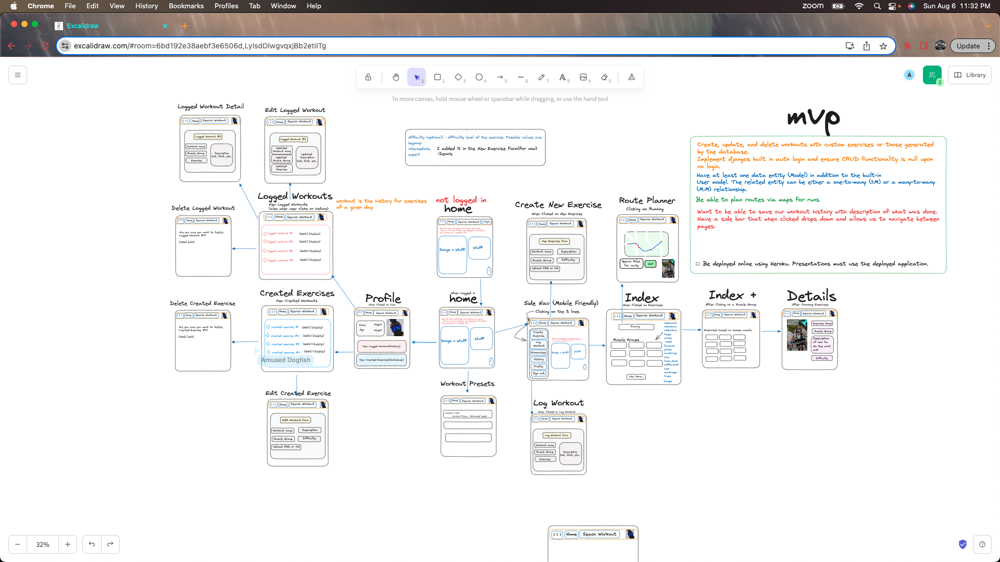

#Fitbuddy
#### FitBuddy is a full stack application that promotes a healthier lifestyle! With 0Auth capability to ensure your data is all about you! Languages,framework and databases that were used:
* Python
* DjangoDB
* JavaScript
* HTML
* CSS

#### Contributions from this amazing team made by Sam, Dennis, and Cory
## Trello Board
[Trello Board Link] (https://trello.com/b/hPTEwQTI/fitness-app)

## Wireframe

## ERD 

## Screenshots
### Home Page

### Map Page

## Add Exercise

## Exercise Database

## Exercise Database Detail

## My Workouts 

## Update Workouts

## Profile

## Update Profile

# Challenges
* Image upload, explored but couldn't get it to work
* Maps Implementation, every step forward was one step confusion.
* Database JSON manipulation to store the database 
* Accessing images via JSON files

# Next steps....
*Add a progress page to track your progress over time

### Super Cool Codes
*The haversine formula determines the great-circle distance between two points on a sphere given their longitudes and latitudes. Important in navigation, it is a special case of a more general formula in spherical trigonometry, the law of haversines, that relates the sides and angles of spherical triangles. AKA distance between two points in relation to the earth.

function haversineDistance(latlng1, latlng2) {
            const R = 6371e3; // Earth's radius in meters
            const φ1 = latlng1.lat * Math.PI / 180;
            const φ2 = latlng2.lat * Math.PI / 180;
            const Δφ = (latlng2.lat - latlng1.lat) * Math.PI / 180;
            const Δλ = (latlng2.lng - latlng1.lng) * Math.PI / 180;
            const a = Math.sin(Δφ / 2) * Math.sin(Δφ / 2) +
                Math.cos(φ1) * Math.cos(φ2) *
                Math.sin(Δλ / 2) * Math.sin(Δλ / 2);
            const c = 2 * Math.atan2(Math.sqrt(a), Math.sqrt(1 - a));
            const distance = R * c;

            return distance;
        }

